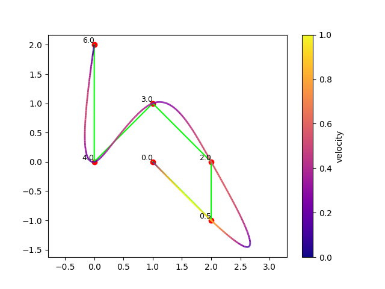
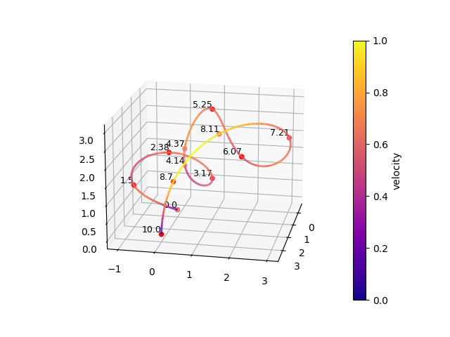

# trajectory_optimization
Define waypoints and timestamps/travel time and get a smooth trajectory by minimizing velocity, acceleration or some higher derivative, both in 2D or 3D.

Refer to `example_timestamps.py` and `example_no_timestamps.py` for a demonstration.

Description of part of the method used can be found at: https://vnav.mit.edu/material/10-TrajectoryOptimization2-notes.pdf

